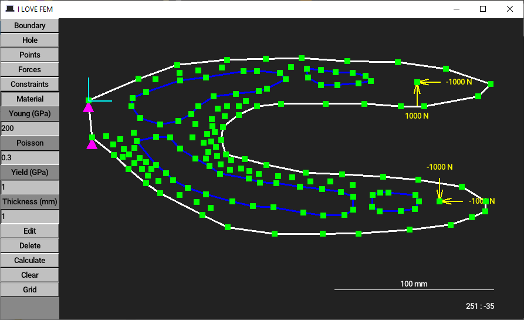
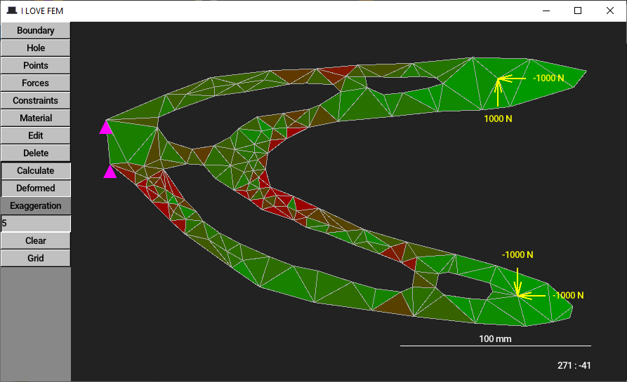

# I ❤︎ FEM
A finite element method demo in [Umka](https://github.com/vtereshkov/umka-lang) and [tophat](https://tophat2d.dev/)

Download the latest release [here](https://github.com/vtereshkov/fem/releases)

**Editor controls**
* Left click: Enter points
* Right click: Confirm entering a polygon
* Middle click and wheel: Pan and zoom

